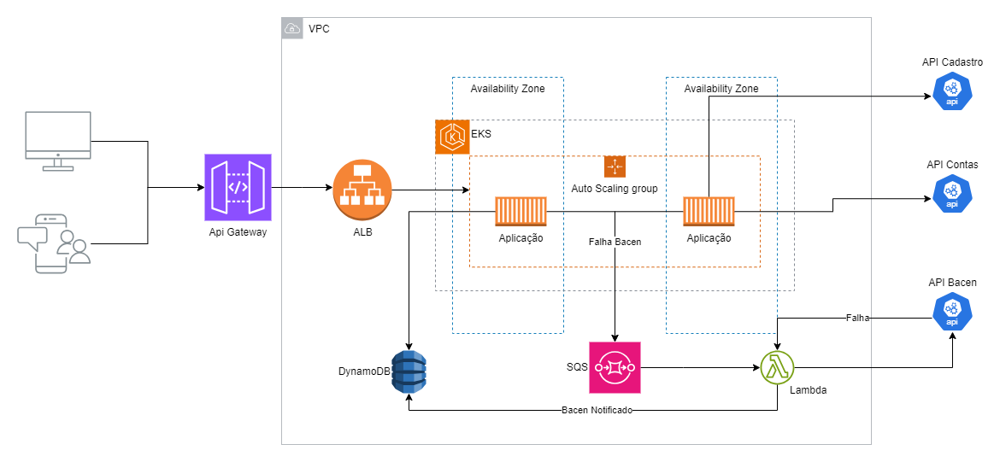

= Arquitetura do Sistema

== Visão Geral da Arquitetura

Este documento detalha a arquitetura do sistema utilizado para processar transações financeiras através da nossa API, descrevendo os componentes principais e o fluxo de requisições.

== Desenho Arquitetural

== Fluxo Detalhado

=== Clientes para API Gateway

. API Gateway.s
. O API Gateway atua como o ponto de entrada para todas as requisições, garantindo a segurança e o roteamento adequado.

=== ALB (Application Load Balancer)

. Após receber a requisição, o API Gateway a encaminha para o ALB.
. O ALB é responsável por distribuir as requisições de maneira eficiente para os pods da aplicação.

=== EKS (Elastic Kubernetes Service)

. O ALB encaminha a requisição para o serviço apropriado executando no EKS.
. O EKS gerencia os pods de aplicação, garantindo escalabilidade e resiliência.

=== Falha em notificar o Bacen da transferência processada

. Se a notificação ao Bacen falhar, é enviado mensagem para fila SQS para reprocessamento.
. Os dados da transação são persistidos no Banco de dados com a coluna bacenNotificado como `Nao`.

=== SQS (Simple Queue Service)

. O SQS armazena as mensagens de falha para processamento assíncrono, garantindo que não se percam e que possam ser reprocessadas.

=== Lambda (Reprocessamento)

. A função Lambda é acionada por mensagens na fila do SQS.
. Tenta reprocessar a mensagem fazendo a chamada à API do Bacen.
. Se a chamada à API do Bacen for bem-sucedida, é enviado update  ao banco de dados na Coluna bacenNotificado como `Sim`.
. Caso falhe, SQS não exclui da fila e envia novamente para reprocessamento.

== Considerações de Desempenho

A arquitetura é projetada para alta disponibilidade e escalabilidade, utilizando serviços gerenciados e carga distribuída.

== Conclusão

Esta arquitetura foi projetada para maximizar a eficiência e a confiabilidade do processamento de requisições na nossa plataforma. Com componentes bem integrados e estratégias de resiliência, garantimos a integridade e a continuidade do serviço.
