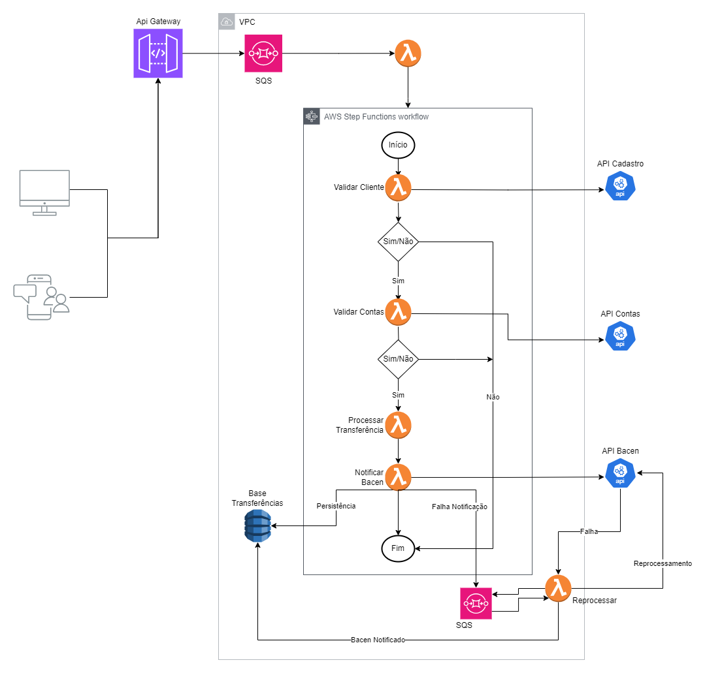

= Proposta de Arquitetura de Transferência entre Contas

== Visão Geral

Arquitetura aqui proposta, utiliza diversos serviços AWS, visando garantir alta disponibilidade, resiliência e escalabilidade.

== Desenho Arquitetural

O processo é iniciado quando uma solicitação de transferência é recebida através do API Gateway, passando por várias etapas de validação e processamento, até a notificação final ao Banco Central. Abaixo está o detalhamento de cada etapa e os serviços AWS utilizados.

=== API Gateway

*Responsabilidade*: Recebe a solicitação HTTP POST de transferência dos clientes. +
*Benefício*: Oferece uma interface de entrada altamente disponível e escalável para as solicitações de transferência.

=== SQS (Simple Queue Service) TransferQueue

*Responsabilidade*: Armazena as mensagens de solicitação de transferência. +
*Benefício*: Garante desacoplamento entre a recepção das solicitações e o processamento, possibilitando escalabilidade e resiliência contra picos de carga.

=== Lambda Processar SQS

*Responsabilidade*: Consome  as mensagens da fila SQS, inicia o workflow no Step Functions. +
*Benefício*: Permite processamento assíncrono para que o fluxo de trabalho seja orquestrado.

=== Step Functions

*Responsabilidade*: Orquestra as chamadas entre Lambdas e outros serviços, gerenciando o fluxo de estados do processo de transferência. +
*Benefício*: Gerencia a sequência de execução das etapas, incluindo tratamento de erros, tentativas automáticas de reprocessamento e oferece visibilidade detalhada do estado e progresso de cada execução, facilitando o monitoramento e a depuração.

=== Lambda Validar Cliente

*Responsabilidade*: Valida se o cliente existe na base cadastral. +
*Benefício*: Garante que apenas clientes válidos iniciem o processo de transferência, evitando erros posteriores.

=== Lambda Validar Contas

*Responsabilidade*: Valida se as contas de origem e destino existem e estão ativas, além de verificar saldo e limite diário. +
*Benefício*: Garante que as transferências só ocorram entre contas válidas, com saldo suficiente e limite diário disponivel.

=== Lambda Processar Transferência

*Responsabilidade*: Realiza o processamento da transferência entre as contas e atualiza os saldos e limites diários na API de contas. +
*Benefício*: Executa a lógica principal da transferência, garantindo a consistência dos dados.

=== Lambda Notificar BACEN

*Responsabilidade*: Notifica o BACEN sobre a transferência concluída com sucesso e persiste os dados da transação no banco. +
*Benefício*: Garante conformidade com requisitos regulatórios, notificando autoridade financeira sobre a transferência processada.

=== SQS (Simple Queue Service) BacenQueue

*Responsabilidade*: Armazena notificações falhadas ao BACEN para reprocessamento. +
*Benefício*: Garante que as notificações falhadas sejam reprocessadas, aumentando a resiliência do sistema.

=== Lambda Retry Notificar BACEN

*Responsabilidade*: Consome mensagens da fila SQS BacenQueue e tenta notificar o BACEN novamente. Caso sucesso, atualiza a coluna bacenNotificado como `Sim` no banco, caso erro envia novamente para reprocessamento +
*Benefício*: Automatiza o reprocessamento de notificações falhadas, garantindo que todas as transferências sejam notificadas ao BACEN eventualmente.

=== DynamoDB

*Responsabilidade*: Armazena os dados da Transferência processada. +
*Benefício*: Mantém registro das transferências processadas, permitindo rastreamento e auditoria.

== Benefícios da Arquitetura Proposta

. *Desacoplamento*: Uso de SQS para desacoplar a recepção e o processamento das solicitações.
. *Escalabilidade*: Lambdas e SQS escalam automaticamente, suportando picos de solicitações.
. *Resiliência*: Step Functions gerencia o fluxo com tentativas automáticas de reprocessamento em caso de falhas.
. *Alta Disponibilidade*: Distribuição das Lambdas e recursos críticos em múltiplas AZs para evitar pontos únicos de falha.
. *Tratamento de Erros*: SQS e Step Functions gerenciam falhas, garantindo que as mensagens e estados não sejam perdidos.
. *Conformidade*: Notificação ao BACEN com reprocessamento automático, garante que as transferências sejam reportadas.
. *Visibilidade*: Step Functions proporciona visibilidade clara do fluxo de trabalho e dos estados das execuções.

== Trade-offs e Preocupações

. *Complexidade*: A arquitetura envolve muitos componentes.
. *Latência*: SQS pode introduzir latência adicional no processamento das transferências.
. *Custo*: Custos associados ao uso de múltiplos serviços AWS.

== Conclusão

A arquitetura proposta oferece uma solução robusta e escalável para o processamento de transferências financeiras, aproveitando a integração e os serviços gerenciados da AWS. Embora haja aumento de complexidade e custos envolvidos, os benefícios em termos de escalabilidade, resiliência e conformidade podem fazer com que esta seja uma abordagem sólida para ambientes de alta demanda e requisitos rigorosos.
